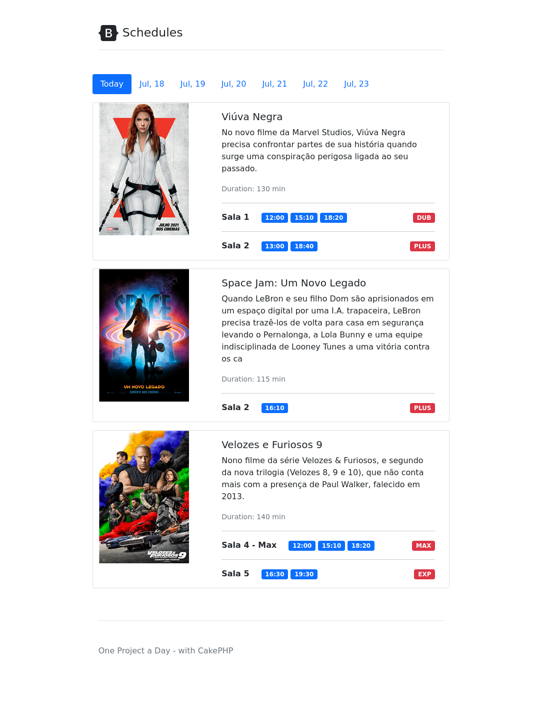

# One CakePHP project a day challenge - Day 06 Movie Theater Schedule

On this project I'm using CakePHP 4 and Boostrap 5

## Steps to create this project

- 62a25b9 Initial commit
- f07a493  Migrations
  ```
  bin/cake bake migration CreateMovies name synopsis duration:integer
  bin/cake bake  migration CreateScreens name tags
  bin/cake bake migration CreateSchedules movie_id:integer screen_id:integer start_time:datetime close_time:datetime
  ```
- e20a200 Models
  ```
  bin/cake bake model Movies
  bin/cake bake model Screens
  bin/cake bake model Schedules
  ```
- 6b8f033 Added custom finder to get schedule by date and group by movies and screns
- 893efef Added main page
- 7000138 Added logic to show dates and fixed route
- 27597e7 Redirect '/' to correct page
## Sample Data
See file [config/Seeds/SampleSeed.php](./config/Seeds/SampleSeed.php)

Run `bin/cake migrations seed`


# Result

